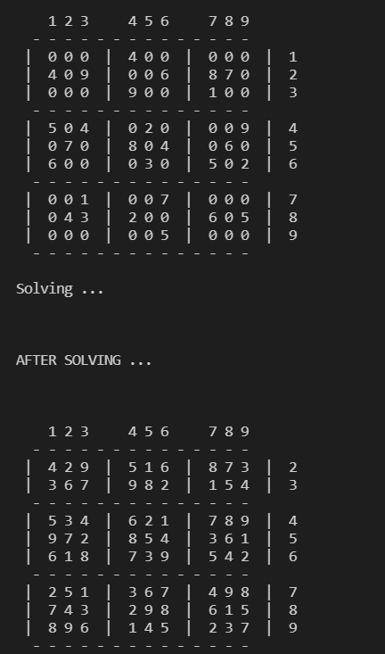

  <h1 align="center">SUDOKU SOLVER USING GRAPH COLORING ALGORITHM</h1>

  
Table of Contents

  <ol>
    <li><a href="#about-the-project">About The Project</a></li>
    <li><a href="#the-algorithm">The Algorithm</a></li>
    <li><a href="#usage">Usage</a></li>
    <li><a href="#future-updates">Future Updates</a></li>
    <li><a href="#resources">Resources</a></li>
    <li><a href="#license">License</a></li>
  </ol>

## About The Project

Sudoku is a single player logic based puzzle. A Sudoku puzzle is a grid of 81 cells, which is divided into 9 rows, columns and regions. The goal is to place the numbers from 1- 9 into empty cells in such a way, that in every row, every column and every region (3 x 3 block) each number appears only once.

  

Originally, I wanted to create a GUI for a sudoku game using the backtracking algorithm. But what got me hooked into this was [Reducible's Introduction To Graph Theory](https://www.youtube.com/watch?v=LFKZLXVO-Dg). I was utterly fascinated by the fact that you can do such cool stuffs with graphs completely contrary to the knowledge I had about it. I have thus implemented the algorithm from scratch using Python.

## The Algorithm

Graph coloring is an assignment of different colors ( or labels) to the vertices of a graph, such that no 2 adjacent (connected) vertices have the same color.

  

In G-Graph Coloring Problem, we have to find if a graph can be colored with a minimum of ‘G’ colors. This ‘G’ is also known as the Chromatic Number of a Graph, and is denoted as χ(G).

Sudoku Graph is a graph with 81 vertices (or nodes). Each cell in the Sudoku can be seen as a node of the graph.

  

So the way this algorithm basically works is:

* Create a recursive function that takes current vertex index, number of vertices and output color array as arguments.
* If the current vertex index is equal to number of vertices. Return True and print the color configuration in output array.
* Assign color to a vertex (1 to m).
* For every assigned color, check if the configuration is safe, (i.e. check if the adjacent vertices do not have the same color) recursively call the function with next index and number of vertices
* If any recursive function returns true break the loop and return true.
* If no recursive function returns true, then return false.

## Usage

Put your sudoku board in solver.py

  

Run solver.py and you will see your solved state.

  

## Future Updates

1. Adding a GUI using Pygames.
2. Making it into a game instead of just solving it.
3. Using opencv to solve real world boards.

## Resources

* [Reducible's Introduction To Graph Theory](https://www.youtube.com/watch?v=LFKZLXVO-Dg)
* [Numberphile](https://www.youtube.com/watch?v=Tnu_Ws7Llo4)
* https://www.codeproject.com/Articles/801268/A-Sudoku-Solver-using-Graph-Coloring
* https://medium.com/code-science/sudoku-solver-graph-coloring-8f1b4df47072
* http://www.cs.kent.edu/~dragan/ST-Spring2016/SudokuGC.pdf

## LICENSE

Distributed under the MIT License. See `LICENSE` for more information.

